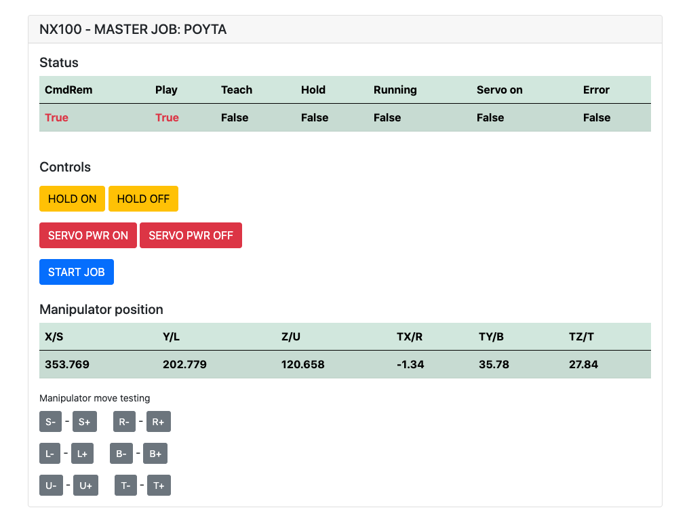

 

# Motoman NX100 - Remote Control

Yaskawa Motoman NX100 industrial robot remote control ability research. 
See [Youtube demo video](https://youtu.be/9swshogfL1c).

Table of contents
=================
* [Documents](#documents)
* [Goals](#goals)
* [Install](#install)
* [Arduino](#arduino)
    * [code](#code)
    * [Sketch](#sketch)
    

Documents
============
Documents for development

* [Ethernet Server Function Manual](https://drive.google.com/file/d/11TY9v_Tb5k23DTz9VuEBmj-vJE5Fmc4R/view) 
    * This document has information about http socket working.
* [Concurrent I/O Manual](https://drive.google.com/file/d/1Dhij10r6Mk60-kloPwJcXpPA7n-u2KN2/view?usp=sharing)
    * Remote IO signal outputs, inputs, all other IO signals and ladder programming information.
* [Youtube demo promo 1](https://youtu.be/9swshogfL1c)
    * First promo video about progress of this repository.

Goals
============

* Simple web page for basic control and monitoring.
* Usable functions and response parsers to work as part of other Python apps.
* Key input functionality for moving robot with keyboard or controller.
* Be able to control NX100 IO card signal outputs and read input states.

Install
============

1. Go to `/module/Socket.py` and change `nx100_address` ip address to your network robot address.
2. Set `/module/Socket.py` MOCK_RESPONSE variable to False for real robot use or use Mock to test without robot.
3. Run app. Web interface opens from `http://localhost:8080/`

Arduino
============
Arduino folder contains code and sketch for custom Gripper integrated for NX100 Motoman.

Code
-------
No notes yet.

Sketch
-------

Custom part sources
* [L298 Stepper Driver](https://forum.fritzing.org/uploads/short-url/cOmtO5zuLdoAiea5hppdo0YsU1N.fzpz)
* [LM2596 Step Down Module](https://forum.fritzing.org/uploads/default/original/2X/8/876018ce35bcc333dd7083f3bbbc5dcc86a9fb20.fzpz)
* [PC817 Opto-isolator](https://github.com/RafaGS/Fritzing/blob/master/Sharp%20PC817.fzpz)
